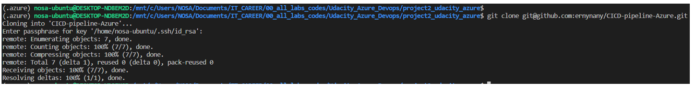

# CICD-pipeline-Azure
Azure DevOps with Udacity - Project 2

Tasks Summary:
- Github actions - Continuous Integration
- Azure pipeline and Azure App service - Continuous Deployment

# Overview
This is a second Project of the Udacity Devops training: Building a CI/CD Pipeline
A summary of the Task Performed in this project include:
- Using Github actions with Makefile and requirement.txt
- Using Application code to perform initial lint, test and install cycle
- intergration of the Project with Azure Pipeline to enable continuous Delivery to Azure App Service

# Project Plan
## Project Spreadsheet
This Spreadsheet shows a detailed weekly, quarterly and Yearly plan for the Project.
[Spreadsheet link](https://docs.google.com/spreadsheets/d/1pYLdA0_Y1qFRxfJB1XAqbG9uTMH4bOtcGZQinWYdgek/edit#gid=1348135932)
## Trello Board
This Trello Board shows a simple work flow of To-dos, In-Progress and Completed Project Tasks
[Trello link](https://trello.com/b/xpcRdzSP/ci-cd-project)

## Architectural Diagram
This diagram shows the workflow of the Project

# CI: Set Up Azure Cloud Shell
## Project Cloned Into Azure Cloud Shell
This screenshot shows the cloning of the repo into Azure cloud shell

## Creating a Makefile, Requirements.txt and Virtual Environment
I created a Makefile, requirements.txt in Azure cloud Shell and added the codes shown in the screenshot shown below and saved

## Local test
The screenshot below shows how the project script and the test script were created. it also shows how the make all command was run and the ouput of the test

## CI: Configure Github Actions
The picture below is a screenshot of passing Action.

## CD: Continous Delivery Azure Pipeline
Firstly, cloned the Flask Starter code and add it to the project
[Link](https://github.com/udacity/nd082-Azure-Cloud-DevOps-Starter-Code/blob/master/C2-AgileDevelopmentwithAzure/project/starter_files/flask-sklearn/app.py)

## Azure App Services
replaced the scaffolding code with Flask Machine Learning code and then Authorized Azure App Service

After the App was deployed, I copied the link of the App in a seperate window to confirm if the App is up and running. The screenshot below shows the result

Next, using the "python app.py" command to also test the App

Using the "./make_predict_azure_app.sh" command to test the app remotely

Using the "az webapp log tail" command to stream the logs from my running application

finally, using the locustfile.py to perform a validation test on the Webapp via load testing

## Azure Pipieline
The following steps were used to set up the Azure Pipeline
- Logged into the Azure Portal, go to Azure Organization and then create a new Project
- From Organization setting, set up new service connection
- Go to Pipeline and create a new pipeline
- click on GitHub Integration and next configure Python to linux Web app on Azure
- Save, run and Validate
The picture below shows the result of the Build and Web App Deployment

The picture below shows the deployed Web App

The Picture below shows the Successful build

Finally, push the code to your gitHub repo

## Demo Video
The video shows a live demo of the working of the Project
[Demo](https://youtu.be/XHYTgc2q4KM)
